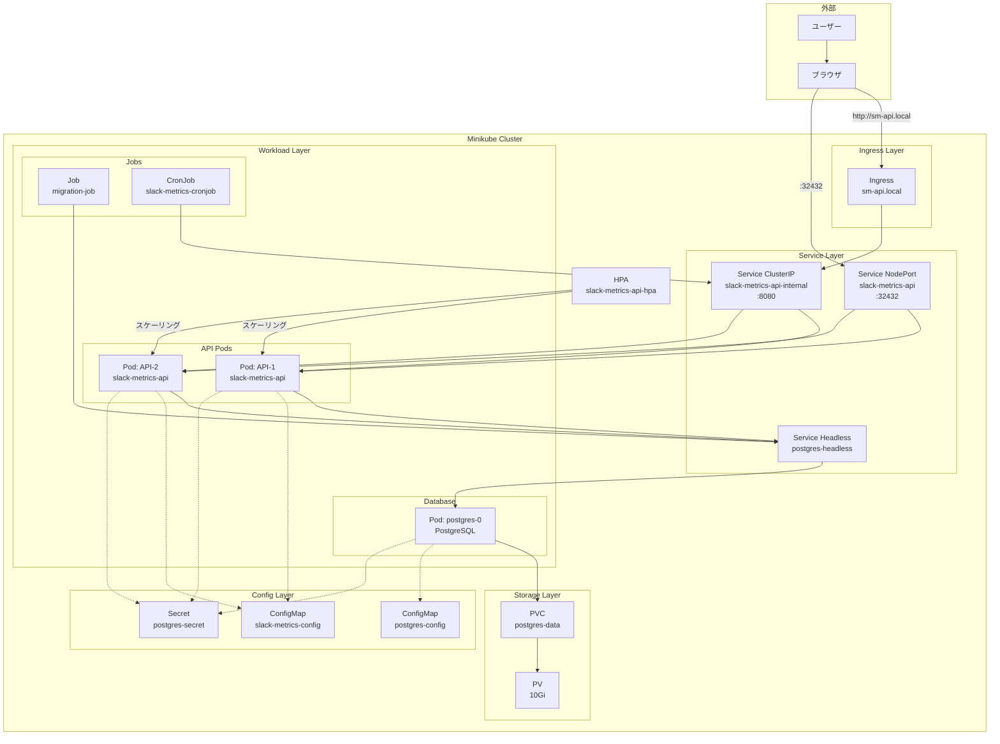
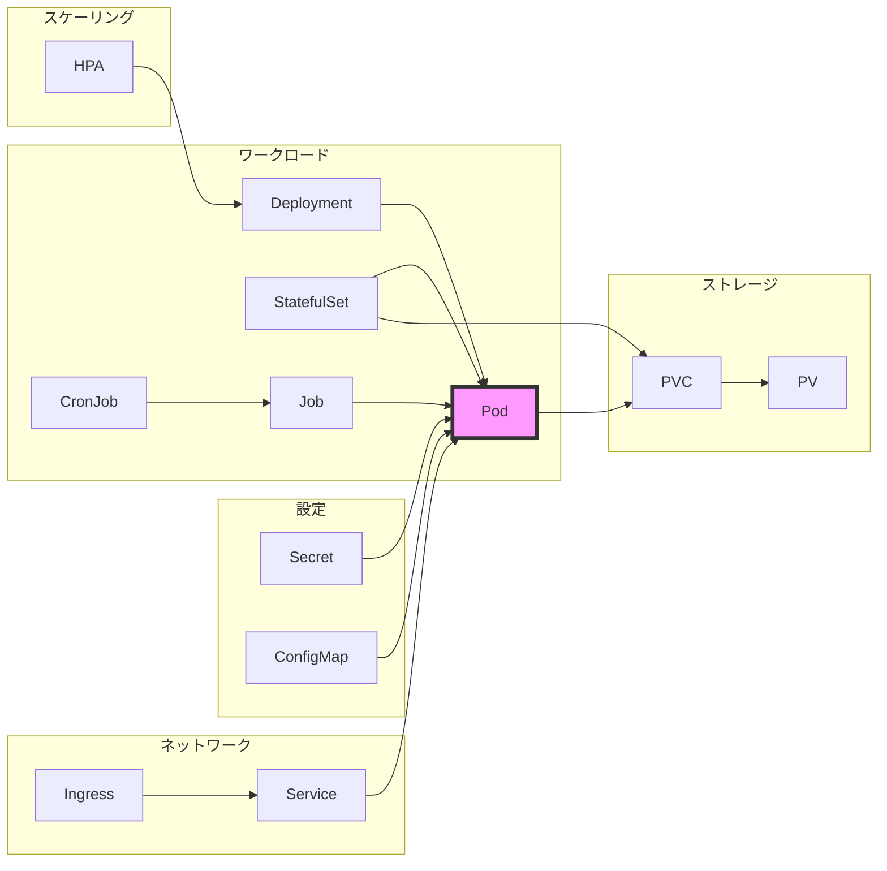

# Kubernetes アーキテクチャ図

このドキュメントでは、本プロジェクトで構築したシステムのアーキテクチャを視覚的に表現します。

## システム全体図



## ネットワークフロー図

```
┌─────────────────────────────────────────────────────────────────┐
│                          外部ネットワーク                          │
└─────────────────────┬───────────────────┬───────────────────────┘
                      │                   │
                      ▼                   ▼
            ┌─────────────────┐   ┌──────────────┐
            │ Ingress (L7)    │   │ NodePort     │
            │ sm-api.local:80 │   │ :32432       │
            └────────┬────────┘   └──────┬───────┘
                     │                   │
    ┌────────────────┴───────────────────┴────────────────┐
    │                  Service Layer (L4)                  │
    │  ┌─────────────────────────────────────────────┐    │
    │  │ slack-metrics-api-internal (ClusterIP)      │    │
    │  │ 10.96.31.4:8080                             │    │
    │  └─────────────────┬───────────────────────────┘    │
    └────────────────────┼────────────────────────────────┘
                         │
    ┌────────────────────┼────────────────────────────────┐
    │                Pod Network                          │
    │  ┌─────────────┴────────────┐                      │
    │  │    API Pods (2 replicas)  │                     │
    │  │    10.244.0.75-76:8080    │                     │
    │  └─────────────┬────────────┘                      │
    │                │                                    │
    │                ▼                                    │
    │  ┌──────────────────────────┐                      │
    │  │ postgres-headless Service │                      │
    │  └─────────────┬────────────┘                      │
    │                │                                    │
    │                ▼                                    │
    │  ┌──────────────────────────┐                      │
    │  │    PostgreSQL Pod         │                      │
    │  │    10.244.0.82:5432       │                      │
    │  └──────────────────────────┘                      │
    └─────────────────────────────────────────────────────┘
```

## Kubernetes コンポーネント配置図

```
┌─────────────────────── Minikube Node ───────────────────────┐
│                                                              │
│  Control Plane                    Worker Components          │
│  ┌────────────────┐               ┌────────────────┐        │
│  │ kube-apiserver │               │    kubelet     │        │
│  └────────┬───────┘               └────────┬───────┘        │
│           │                                 │                │
│  ┌────────▼───────┐               ┌────────▼───────┐        │
│  │      etcd      │               │   kube-proxy   │        │
│  └────────────────┘               └────────────────┘        │
│                                                              │
│  ┌────────────────┐               ┌────────────────┐        │
│  │ kube-scheduler │               │ Container      │        │
│  └────────────────┘               │ Runtime        │        │
│                                   │ (Docker)       │        │
│  ┌────────────────┐               └────────┬───────┘        │
│  │ kube-controller│                        │                │
│  │ -manager       │               ┌────────▼───────┐        │
│  └────────────────┘               │     Pods       │        │
│                                   └────────────────┘        │
│  ┌────────────────┐                                         │
│  │ CoreDNS        │                                         │
│  └────────────────┘                                         │
│                                                              │
│  ┌────────────────┐                                         │
│  │ Metrics Server │                                         │
│  └────────────────┘                                         │
└──────────────────────────────────────────────────────────────┘
```

## リソース依存関係図



## データフロー図

```
┌──────────┐     HTTP Request      ┌─────────┐
│  Client  │ ──────────────────▶  │ Ingress │
└──────────┘                       └────┬────┘
                                        │
                                        ▼
                              ┌─────────────────┐
                              │ Service (L4 LB) │
                              └────────┬────────┘
                                       │
                          ┌────────────┴────────────┐
                          ▼                        ▼
                  ┌───────────────┐        ┌───────────────┐
                  │   API Pod 1   │        │   API Pod 2   │
                  └───────┬───────┘        └───────┬───────┘
                          │                        │
                          └────────┬───────────────┘
                                   │
                                   ▼ SQL Query
                          ┌─────────────────┐
                          │ PostgreSQL Pod  │
                          └────────┬────────┘
                                   │
                                   ▼ Write
                          ┌─────────────────┐
                          │ Persistent      │
                          │ Volume          │
                          └─────────────────┘

データの流れ:
1. クライアントからの HTTP リクエスト
2. Ingress でホスト名/パスベースのルーティング
3. Service でロードバランシング
4. API Pod でビジネスロジック処理
5. PostgreSQL へのデータ永続化
6. レスポンスを逆順で返却
```

## CronJob 実行フロー

```
┌─────────────┐     毎日 9:00 (JST)    ┌──────────────┐
│ CronJob     │ ────────────────────▶ │ Job 作成      │
└─────────────┘                       └──────┬───────┘
                                              │
                                              ▼
                                      ┌───────────────┐
                                      │ Pod 起動      │
                                      └──────┬────────┘
                                              │
                                              ▼
                                      ┌───────────────┐
                                      │ バッチ処理実行 │
                                      └──────┬────────┘
                                              │
                          ┌───────────────────┴───────────────────┐
                          ▼                                       ▼
                  ┌───────────────┐                       ┌──────────────┐
                  │ API 呼び出し   │                       │ Slack 通知    │
                  │ (Internal Svc) │                       │ (外部 API)    │
                  └───────┬───────┘                       └──────────────┘
                          │
                          ▼
                  ┌───────────────┐
                  │ DB 更新        │
                  │ (postgres)     │
                  └───────────────┘
```

## セキュリティ境界

```
┌─────────────────────────────────────────────────────────┐
│                     インターネット                        │
└────────────────────────┬────────────────────────────────┘
                         │ ファイアウォール
                         ▼
┌─────────────────────────────────────────────────────────┐
│                  Ingress Controller                      │
│                  - SSL/TLS 終端                          │
│                  - ホスト名検証                          │
└────────────────────────┬────────────────────────────────┘
                         │
┌────────────────────────┼────────────────────────────────┐
│  Kubernetes Cluster    │                                │
│  ┌─────────────────────▼──────────────────────┐        │
│  │ Service Network (内部通信のみ)              │        │
│  │ - ClusterIP による分離                      │        │
│  │ - NetworkPolicy (未実装)                    │        │
│  └─────────────────────┬──────────────────────┘        │
│                        │                                │
│  ┌─────────────────────▼──────────────────────┐        │
│  │ Pod Security                                │        │
│  │ - SecurityContext                           │        │
│  │ - 非 root ユーザー実行                      │        │
│  │ - Read-only ファイルシステム                 │        │
│  └────────────────────────────────────────────┘        │
│                                                         │
│  ┌────────────────────────────────────────────┐        │
│  │ Secret Management                           │        │
│  │ - 環境変数による注入                         │        │
│  │ - Base64 エンコード（暗号化ではない）        │        │
│  └────────────────────────────────────────────┘        │
└─────────────────────────────────────────────────────────┘
```

## まとめ

このアーキテクチャ図は、Kubernetes 入門コースで構築したシステムの全体像を示しています。主要なポイント：

1. **多層構造**: Ingress → Service → Pod → Storage の階層的な構成
2. **高可用性**: HPA による自動スケーリング、複数レプリカの配置
3. **永続性**: StatefulSet と PVC による データベースの永続化
4. **定期処理**: CronJob によるバッチ処理の自動化
5. **設定管理**: ConfigMap と Secret による設定の外部化

このアーキテクチャは、実際のプロダクション環境でも応用可能な基本的なパターンを網羅しています。
