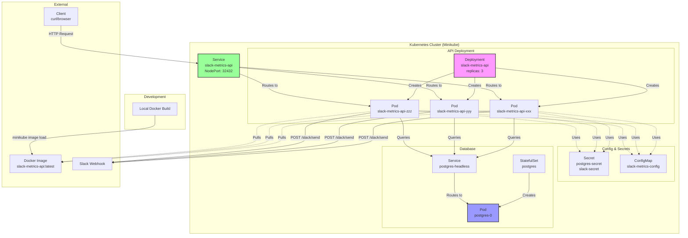
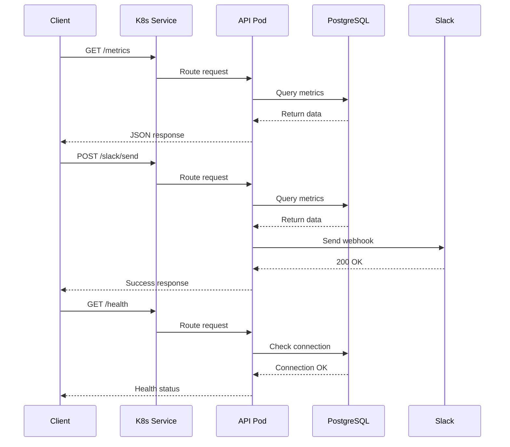

# Slack Metrics API 実装ガイド

## 概要

Slack Metrics API は、既存の CronJob バッチ処理を HTTP API として再実装したものです。データベースのメトリクスを収集し、JSON 形式で提供するとともに、Slack への通知機能も提供します。

### 主な機能

- PostgreSQL データベースのメトリクス収集（サイズ、テーブル数、アクティブ接続数）
- REST API による JSON 形式でのメトリクス提供
- Slack Webhook への直接送信機能
- ヘルスチェックエンドポイントによる監視対応
- Kubernetes 環境での高可用性デプロイメント（3 レプリカ）

## アーキテクチャ図

### システム全体の構成



### API リクエストフロー



## 実装内容

### 作成したファイル一覧

```
k8s-study/
├── apps/
│   └── api/                    # API アプリケーション
│       ├── main.go             # API サーバーのメインコード
│       ├── go.mod              # Go モジュール定義
│       ├── go.sum              # 依存関係のロックファイル
│       └── Dockerfile          # Docker イメージビルド用
└── deployments/
    └── api/                    # Kubernetes マニフェスト
        ├── deployment.yaml     # Deployment 定義（3レプリカ）
        └── service.yaml        # NodePort Service 定義
```

### 使用技術

- **言語**: Go 1.21
- **フレームワーク**: 標準ライブラリの `net/http` パッケージ
- **データベース**: PostgreSQL（`github.com/lib/pq` ドライバー）
- **コンテナ**: Docker（マルチステージビルド）
- **オーケストレーション**: Kubernetes (Minikube)

## API エンドポイント詳細

### 1. ルートエンドポイント

```bash
GET /
```

**レスポンス例**:

```json
{
  "service": "slack-metrics-api",
  "version": "1.0.0"
}
```

### 2. ヘルスチェック

```bash
GET /health
```

データベース接続を確認し、サービスの健全性を返します。

**レスポンス例**:

```json
{
  "status": "healthy",
  "time": "2025-09-20T01:33:12Z"
}
```

### 3. メトリクス取得

```bash
GET /metrics
```

PostgreSQL のメトリクスを収集して返します。

**レスポンス例**:

```json
{
  "db_size_mb": 7.434370994567871,
  "table_count": 3,
  "active_connections": 1,
  "timestamp": "2025-09-20T01:33:16.578534341Z"
}
```

### 4. Slack 送信

```bash
POST /slack/send
```

メトリクスを収集し、設定された Slack Webhook URL に送信します。

**レスポンス例**:

```json
{
  "status": "success",
  "message": "Metrics sent to Slack successfully"
}
```

**Slack メッセージ形式**:

- `REPORT_FORMAT=simple` の場合: テキストメッセージ
- `REPORT_FORMAT=detailed` の場合: Block Kit を使用したリッチメッセージ

## デプロイメント構成

### Deployment の設定

- **レプリカ数**: 3（高可用性）
- **イメージプルポリシー**: Never（ローカルイメージを使用）
- **リソース制限**:
  - CPU: 250m（リクエスト）/ 500m（リミット）
  - Memory: 64Mi（リクエスト）/ 128Mi（リミット）
- **ヘルスチェック**:
  - Liveness Probe: `/health` を 30 秒間隔でチェック
  - Readiness Probe: `/health` を 10 秒間隔でチェック

### 環境変数の構成

| 環境変数            | 取得元                          | 説明                  |
| ------------------- | ------------------------------- | --------------------- |
| `SLACK_WEBHOOK_URL` | Secret: slack-secret            | Slack Webhook の URL  |
| `DB_HOST`           | 直接設定                        | postgres-headless     |
| `DB_PORT`           | 直接設定                        | 5432                  |
| `DB_USER`           | Secret: postgres-secret         | PostgreSQL ユーザー   |
| `DB_PASSWORD`       | Secret: postgres-secret         | PostgreSQL パスワード |
| `DB_NAME`           | Secret: postgres-secret         | データベース名        |
| `DB_SSLMODE`        | 直接設定                        | disable               |
| `METRICS_TYPE`      | ConfigMap: slack-metrics-config | メトリクスタイプ      |
| `REPORT_FORMAT`     | ConfigMap: slack-metrics-config | レポート形式          |

### Service の設定

- **タイプ**: NodePort
- **クラスター内ポート**: 8080
- **NodePort**: 32432（外部アクセス用）

## 使用方法

### 1. Docker イメージのビルド

```bash
cd apps/api/
docker build -t slack-metrics-api:latest .
```

### 2. minikube へのイメージロード

```bash
minikube image load slack-metrics-api:latest
```

### 3. Kubernetes へのデプロイ

```bash
kubectl apply -f deployments/api/
```

### 4. デプロイ確認

```bash
# Pod の状態確認
kubectl get pods -l app=slack-metrics-api

# Service の確認
kubectl get service slack-metrics-api

# すべてのリソース確認
kubectl get all -l app=slack-metrics-api
```

### 5. アクセス方法

#### ポートフォワード経由（推奨）

```bash
# ポートフォワードの設定
kubectl port-forward service/slack-metrics-api 8080:8080

# API へのアクセス
curl http://localhost:8080/metrics
curl -X POST http://localhost:8080/slack/send
```

#### NodePort 経由

```bash
# minikube IP の確認
minikube ip
# 例: 192.168.49.2

# API へのアクセス
curl http://192.168.49.2:32432/metrics
```

※ NodePort はネットワーク設定により利用できない場合があります。

## 運用とトラブルシューティング

### ログの確認

```bash
# すべての Pod のログを確認
kubectl logs -l app=slack-metrics-api

# 特定の Pod のログを確認
kubectl logs <pod-name>

# ログをフォロー
kubectl logs -f <pod-name>
```

### よくある問題と対処法

#### 1. Pod が起動しない

**症状**: Pod のステータスが `ImagePullBackOff` や `ErrImageNeverPull`

**対処法**:

```bash
# イメージが minikube にロードされているか確認
minikube image ls | grep slack-metrics-api

# イメージを再ロード
minikube image load slack-metrics-api:latest
```

#### 2. データベース接続エラー

**症状**: ヘルスチェックが失敗、ログに接続エラー

**対処法**:

```bash
# PostgreSQL Pod の状態確認
kubectl get pod postgres-0

# Secret の存在確認
kubectl get secret postgres-secret

# Service の確認
kubectl get service postgres-headless
```

#### 3. Slack 送信エラー

**症状**: `/slack/send` がエラーを返す

**対処法**:

```bash
# Secret の確認
kubectl get secret slack-secret

# Webhook URL の設定確認
kubectl get secret slack-secret -o yaml
```

### スケーリング

```bash
# レプリカ数の変更
kubectl scale deployment slack-metrics-api --replicas=5

# オートスケーリングの設定
kubectl autoscale deployment slack-metrics-api --min=2 --max=10 --cpu-percent=80
```

### アップデート手順

1. 新しいイメージをビルド
2. minikube にロード
3. Deployment を更新

```bash
# イメージの更新
kubectl set image deployment/slack-metrics-api slack-metrics-api=slack-metrics-api:v2
```

## まとめ

Slack Metrics API は、既存の CronJob バッチ処理を拡張し、リアルタイムでメトリクスを提供する API として実装されました。Kubernetes の Deployment により高可用性を実現し、標準的な REST API インターフェースを通じて、データベースメトリクスの取得と Slack への通知が可能になりました。

今後の改善点として以下が考えられます：

1. 認証機能の追加（JWT トークンなど）
2. メトリクスの種類拡張（CPU、メモリ使用率など）
3. Prometheus 形式でのメトリクス提供
4. WebSocket によるリアルタイム更新
5. グラフィカルなダッシュボード UI の追加
