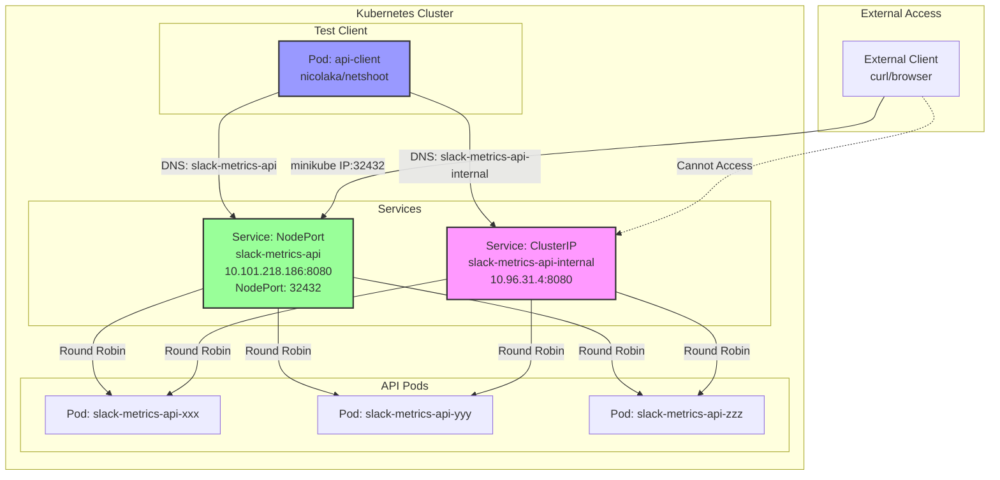
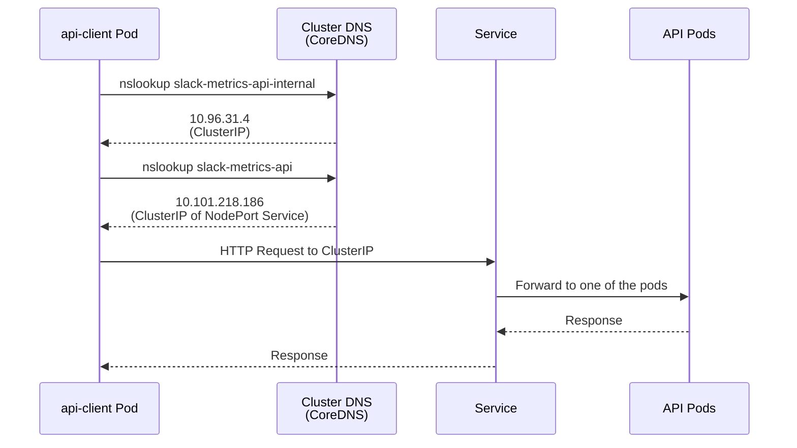

# Kubernetes Service タイプの理解と実装ガイド

## 概要

このドキュメントでは、Kubernetes の Service タイプ（NodePort と ClusterIP）の違いと、内部アクセステスト用の api-client Pod の実装について説明します。

## Service タイプの比較

| タイプ | アクセス範囲 | 用途 | ポート範囲 |
|--------|-------------|------|------------|
| **ClusterIP** | クラスター内部のみ | マイクロサービス間通信、内部 API | 任意 |
| **NodePort** | クラスター外部からも可能 | 外部公開、開発環境でのテスト | 30000-32767 |
| **LoadBalancer** | クラウドプロバイダー経由 | 本番環境の外部公開 | 任意 |

## アーキテクチャ図

### Service 構成とアクセスパターン



### DNS 解決のフロー



## 実装内容

### 1. ClusterIP Service

**ファイル**: `deployments/api/service-clusterip.yaml`

```yaml
apiVersion: v1
kind: Service
metadata:
  name: slack-metrics-api-internal
  namespace: default
  labels:
    app: slack-metrics-api
spec:
  type: ClusterIP
  selector:
    app: slack-metrics-api
  ports:
    - port: 8080
      targetPort: 8080
      protocol: TCP
      name: http
```

**特徴**:
- クラスター内部からのみアクセス可能
- 自動的に ClusterIP が割り当てられる（10.96.31.4）
- DNS 名: `slack-metrics-api-internal.default.svc.cluster.local`

### 2. api-client Pod

**ファイル**: `deployments/api/client-pod.yaml`

```yaml
apiVersion: v1
kind: Pod
metadata:
  name: api-client
  namespace: default
  labels:
    app: api-client
spec:
  containers:
    - name: client
      image: nicolaka/netshoot:latest
      imagePullPolicy: IfNotPresent
      command: ["/bin/bash"]
      args: ["-c", "while true; do sleep 3600; done"]
      resources:
        limits:
          cpu: "100m"
          memory: "128Mi"
        requests:
          cpu: "50m"
          memory: "64Mi"
```

**含まれるツール**:
- curl, wget - HTTP クライアント
- nslookup, dig - DNS ツール
- netstat, ss - ネットワーク状態確認
- tcpdump - パケットキャプチャ
- jq - JSON パーサー

## Service 一覧

| Service 名 | タイプ | ClusterIP | ポート | NodePort | 用途 |
|-----------|--------|-----------|--------|----------|------|
| slack-metrics-api | NodePort | 10.101.218.186 | 8080 | 32432 | 外部アクセス用 |
| slack-metrics-api-internal | ClusterIP | 10.96.31.4 | 8080 | - | 内部専用 |

## アクセスパターン

### 1. クラスター内部から（api-client Pod）

```bash
# ClusterIP Service 経由
kubectl exec -it api-client -- curl http://slack-metrics-api-internal:8080/metrics

# NodePort Service 経由（内部アクセス）
kubectl exec -it api-client -- curl http://slack-metrics-api:8080/metrics

# 直接 IP アドレスを使用
kubectl exec -it api-client -- curl http://10.96.31.4:8080/metrics
```

### 2. クラスター外部から

```bash
# NodePort 経由（minikube の場合）
curl http://$(minikube ip):32432/metrics

# Port Forward 経由
kubectl port-forward service/slack-metrics-api 8080:8080
curl http://localhost:8080/metrics
```

### 3. DNS 確認

```bash
# DNS 解決の確認
kubectl exec -it api-client -- nslookup slack-metrics-api-internal
kubectl exec -it api-client -- nslookup slack-metrics-api

# 完全修飾ドメイン名（FQDN）
kubectl exec -it api-client -- curl http://slack-metrics-api-internal.default.svc.cluster.local:8080/health
```

## ユースケース

### ClusterIP Service の使用場面

1. **マイクロサービス間通信**
   ```
   Frontend Pod → Backend Service (ClusterIP) → Backend Pods
   ```

2. **内部 API**
   ```
   Worker Pod → Internal API Service (ClusterIP) → API Pods
   ```

3. **データベース接続**
   ```
   Application Pod → Database Service (ClusterIP) → Database Pod
   ```

### NodePort Service の使用場面

1. **開発環境での外部アクセス**
2. **オンプレミス環境でのシンプルな公開**
3. **LoadBalancer が使えない環境での代替**

## トラブルシューティング

### 1. Service にアクセスできない

```bash
# Service の存在確認
kubectl get service

# Endpoints の確認（Pod が正しく選択されているか）
kubectl get endpoints slack-metrics-api-internal

# Pod のラベル確認
kubectl get pods -l app=slack-metrics-api --show-labels
```

### 2. DNS 解決ができない

```bash
# CoreDNS の状態確認
kubectl get pods -n kube-system | grep coredns

# DNS 設定の確認
kubectl exec -it api-client -- cat /etc/resolv.conf
```

### 3. ネットワークの詳細調査

```bash
# api-client から tcpdump でパケットキャプチャ
kubectl exec -it api-client -- tcpdump -i any host 10.96.31.4

# ネットワーク接続状態の確認
kubectl exec -it api-client -- ss -tan
```

## ベストプラクティス

1. **Service タイプの選択**
   - 内部通信: ClusterIP
   - 開発環境: NodePort
   - 本番環境: LoadBalancer または Ingress

2. **ネーミング規則**
   - 外部向け: `<app-name>`
   - 内部向け: `<app-name>-internal`

3. **セキュリティ**
   - ClusterIP を使用して内部通信を隔離
   - NetworkPolicy で通信を制限
   - 外部公開は必要最小限に

4. **監視とデバッグ**
   - api-client のような診断用 Pod を準備
   - Service のヘルスチェックエンドポイントを実装
   - ログとメトリクスの収集

## まとめ

ClusterIP Service は Kubernetes クラスター内部の通信に最適化された Service タイプです。外部からのアクセスが不要な内部 API やマイクロサービス間の通信では、ClusterIP を使用することでセキュリティを向上させることができます。

api-client Pod のようなテスト用クライアントを用意することで、Service の動作確認やトラブルシューティングが容易になります。本番環境でも、診断用の Pod を用意しておくことは、問題解決の迅速化に貢献します。