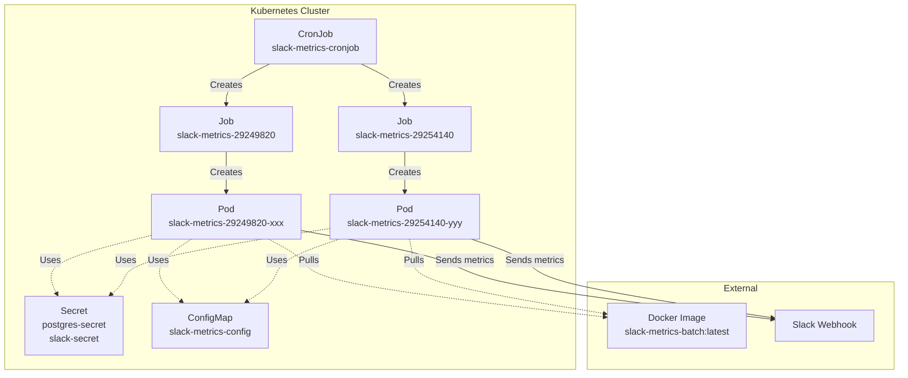
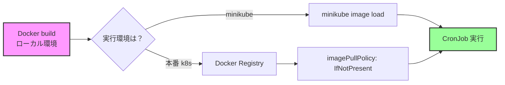
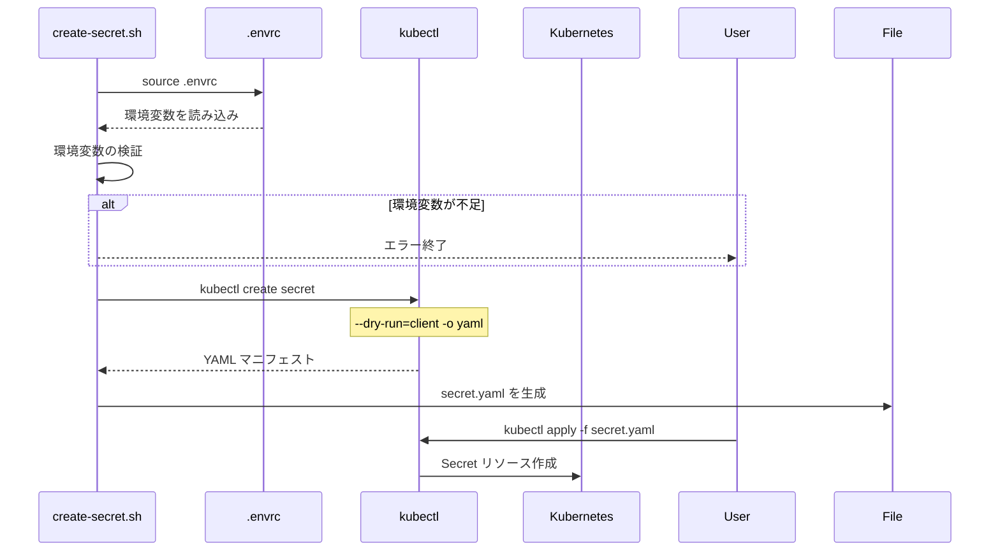

# Kubernetes CronJob トラブルシューティングガイド

## 概要

このドキュメントでは、Kubernetes の CronJob を運用する際に遭遇する一般的な問題とその解決方法について説明します。

## アーキテクチャ図



## 問題1: 古い Job と Pod が削除されない

### 症状

```bash
$ kubectl get pods
NAME                                   READY   STATUS      RESTARTS   AGE
slack-metrics-cronjob-29249820-bvtdv   0/1     Completed   0          38d
slack-metrics-cronjob-29254140-kh9bz   0/1     Completed   0          35d
slack-metrics-cronjob-29258460-xkq6x   0/1     Completed   0          32d
```

### 原因

CronJob の History Limits が設定されていない、または適切に設定されていない。

### 解決方法

```yaml
apiVersion: batch/v1
kind: CronJob
metadata:
  name: slack-metrics-cronjob
spec:
  schedule: "0 9 * * *"
  successfulJobsHistoryLimit: 1  # 成功した Job を1つだけ保持
  failedJobsHistoryLimit: 1      # 失敗した Job を1つだけ保持
  jobTemplate:
    # ...
```

### 手動クリーンアップ

```bash
# 古い Job を削除
kubectl delete job slack-metrics-cronjob-29249820
kubectl delete job slack-metrics-cronjob-29254140
kubectl delete job slack-metrics-cronjob-29258460
```

## 問題2: Docker イメージが見つからない (ErrImageNeverPull)

### 症状

```
Container image "slack-metrics-batch:latest" is not present with pull policy of Never
```

### 原因

`imagePullPolicy: Never` が設定されているが、ノード（minikube）にイメージが存在しない。

### 解決方法のフロー



### 解決手順

#### 方法1: minikube に直接ビルド

```bash
# minikube の Docker 環境を使用
eval $(minikube docker-env)

# イメージをビルド
cd batch-scripts/
docker build -t slack-metrics-batch:latest .

# 通常の Docker 環境に戻す
eval $(minikube docker-env -u)
```

#### 方法2: ローカルビルド + minikube へロード（推奨）

```bash
# ローカルでビルド
cd batch-scripts/
docker build -t slack-metrics-batch:latest .

# minikube にイメージをロード
minikube image load slack-metrics-batch:latest

# 確認
minikube image ls | grep slack-metrics
```

## 問題3: Go コードのコンパイルエラー

### 症状

```
./send-slack-metrics.go:161:20: undefined: io
```

### 原因

必要なパッケージがインポートされていない。

### 解決方法

```go
import (
    "bytes"
    "database/sql"
    "encoding/json"
    "fmt"
    "io"  // 追加
    "log"
    "net/http"
    "os"
    "time"

    _ "github.com/lib/pq"
)
```

## CronJob の即時実行

### 方法

既存の CronJob から手動で Job を作成：

```bash
kubectl create job --from=cronjob/slack-metrics-cronjob slack-metrics-manual-$(date +%s)
```

### 実行確認

```bash
# Job の状態を確認
kubectl get jobs

# Pod の状態を確認
kubectl get pods

# ログを確認
kubectl logs <pod-name>
```

## Secret の作成と環境変数

### Secret 作成スクリプトの仕組み



### 注意点

- `.envrc` ファイルは Git リポジトリにコミットしない
- `.envrc.example` をテンプレートとして提供
- Secret の値は自動的に Base64 エンコードされる

## ベストプラクティス

### 1. リソース制限の設定

```yaml
resources:
  limits:
    cpu: "500m"
    memory: "128Mi"
  requests:
    cpu: "250m"
    memory: "64Mi"
```

### 2. タイムゾーンの考慮

```yaml
spec:
  schedule: "0 9 * * *"  # UTC での指定
  # または
  schedule: "0 0 * * *"  # JST 9:00 = UTC 0:00
```

### 3. 監視とアラート

- Job の失敗を検知するための監視を設定
- Slack 通知自体が失敗した場合の対策を検討

### 4. ログの保存

```bash
# Job のログを確認
kubectl logs -l job-name=<job-name>

# 過去の Job のログを保存
kubectl logs <pod-name> > logs/cronjob-$(date +%Y%m%d).log
```

## トラブルシューティングチェックリスト

- [ ] CronJob の History Limits は設定されているか？
- [ ] Docker イメージは適切な場所に存在するか？
- [ ] 必要な Secret と ConfigMap は作成されているか？
- [ ] Pod のログにエラーは出ていないか？
- [ ] ネットワーク接続（DB、Slack）は正常か？
- [ ] リソース（CPU、メモリ）は十分か？

## 参考リンク

- [Kubernetes CronJob Documentation](https://kubernetes.io/docs/concepts/workloads/controllers/cron-jobs/)
- [minikube image Commands](https://minikube.sigs.k8s.io/docs/commands/image/)
- [Kubernetes Secrets](https://kubernetes.io/docs/concepts/configuration/secret/)