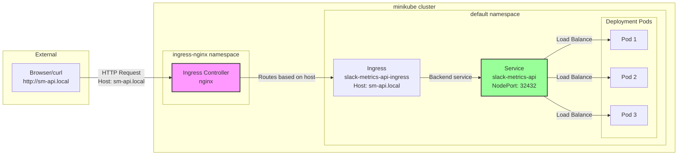

# Ingress で Slack Metrics API を外部公開するガイド

## 概要

このドキュメントでは、Kubernetes Ingress を使用して Slack Metrics API を `http://sm-api.local` でアクセスできるように設定する手順を説明します。

## アーキテクチャ図



## 実装手順

### 1. Ingress Controller の有効化

minikube には NGINX Ingress Controller アドオンが含まれています。

```bash
# Ingress アドオンを有効化
minikube addons enable ingress

# Controller Pod の起動を確認
kubectl get pods -n ingress-nginx
```

### 2. Ingress リソースの作成

**ファイル**: `deployments/api/ingress.yaml`

```yaml
apiVersion: networking.k8s.io/v1
kind: Ingress
metadata:
  name: slack-metrics-api-ingress
  namespace: default
  labels:
    app: slack-metrics-api
  annotations:
    nginx.ingress.kubernetes.io/rewrite-target: /
spec:
  ingressClassName: nginx
  rules:
    - host: sm-api.local
      http:
        paths:
          - path: /
            pathType: Prefix
            backend:
              service:
                name: slack-metrics-api
                port:
                  number: 8080
```

### 3. Ingress のデプロイ

```bash
kubectl apply -f deployments/api/ingress.yaml
```

### 4. ホスト名の設定

`/etc/hosts` ファイルにエントリを追加：

```bash
# minikube の IP を確認
minikube ip
# 例: 192.168.49.2

# hosts ファイルに追加
echo "192.168.49.2  sm-api.local" | sudo tee -a /etc/hosts
```

### 5. minikube tunnel の起動

Ingress を外部からアクセス可能にするには、`minikube tunnel` が必要です：

```bash
# tunnel を起動（sudo が必要）
sudo minikube tunnel

# または作成したスクリプトを使用
bash deployments/api/start-tunnel.sh
```

## アクセス方法

minikube tunnel が起動している状態で：

```bash
# ヘルスチェック
curl http://sm-api.local/health

# メトリクス取得
curl http://sm-api.local/metrics

# Slack 送信
curl -X POST http://sm-api.local/slack/send
```

## Service タイプの比較

### NodePort vs Ingress

| 項目 | NodePort | Ingress |
|------|----------|---------|
| アクセス方法 | `IP:ポート番号` | `ホスト名` |
| ポート | 30000-32767 の範囲 | 標準の 80/443 |
| SSL/TLS | Service レベルで設定が必要 | Ingress で簡単に設定可能 |
| ホストベースルーティング | 不可 | 可能 |
| パスベースルーティング | 不可 | 可能 |
| 用途 | 開発・テスト環境 | 本番環境 |

## トラブルシューティング

### 1. Ingress にアドレスが割り当てられない

```bash
# Ingress の状態確認
kubectl get ingress slack-metrics-api-ingress

# ADDRESS 列が空の場合は、少し待つか Controller を確認
kubectl get pods -n ingress-nginx
```

### 2. sm-api.local にアクセスできない

**原因 1**: `/etc/hosts` の設定ミス

```bash
# 設定を確認
grep sm-api.local /etc/hosts

# ping で名前解決を確認
ping -c 1 sm-api.local
```

**原因 2**: minikube tunnel が起動していない

```bash
# 別のターミナルで tunnel を起動
sudo minikube tunnel
```

**原因 3**: Ingress Controller が正常に動作していない

```bash
# Controller のログを確認
kubectl logs -n ingress-nginx -l app.kubernetes.io/component=controller
```

### 3. 503 Service Unavailable エラー

バックエンドの Service や Pod に問題がある可能性：

```bash
# Service の Endpoints を確認
kubectl get endpoints slack-metrics-api

# Pod の状態を確認
kubectl get pods -l app=slack-metrics-api
```

## 高度な設定

### SSL/TLS の設定

本番環境では HTTPS を使用することを推奨：

```yaml
spec:
  tls:
    - hosts:
        - sm-api.local
      secretName: sm-api-tls-secret
  rules:
    - host: sm-api.local
      # ... 既存の設定
```

### パスベースのルーティング

複数のサービスを同じホストで公開：

```yaml
rules:
  - host: sm-api.local
    http:
      paths:
        - path: /api
          pathType: Prefix
          backend:
            service:
              name: slack-metrics-api
              port:
                number: 8080
        - path: /docs
          pathType: Prefix
          backend:
            service:
              name: documentation-service
              port:
                number: 80
```

### レート制限の設定

```yaml
metadata:
  annotations:
    nginx.ingress.kubernetes.io/limit-rps: "10"
    nginx.ingress.kubernetes.io/limit-connections: "5"
```

## ベストプラクティス

1. **ホスト名の命名規則**
   - 環境を表す: `api.dev.local`、`api.staging.local`
   - サービスを表す: `metrics-api.local`、`admin-api.local`

2. **Ingress の整理**
   - 1つの Ingress で関連するサービスをまとめる
   - 環境ごとに namespace を分ける

3. **監視とログ**
   - Ingress Controller のメトリクスを監視
   - アクセスログを有効化して分析

4. **セキュリティ**
   - 本番環境では必ず TLS を使用
   - 必要に応じて Basic 認証や OAuth を追加
   - CORS ヘッダーを適切に設定

## まとめ

Ingress を使用することで、Kubernetes クラスター内のサービスをより柔軟に外部公開できます。NodePort と比較して、標準的なポート（80/443）でアクセスでき、ホスト名ベースのルーティングが可能になります。

本番環境では、クラウドプロバイダーのロードバランサーや、より高機能な Ingress Controller（Traefik、HAProxy など）の使用も検討してください。